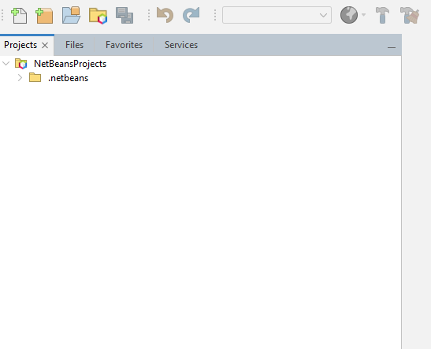
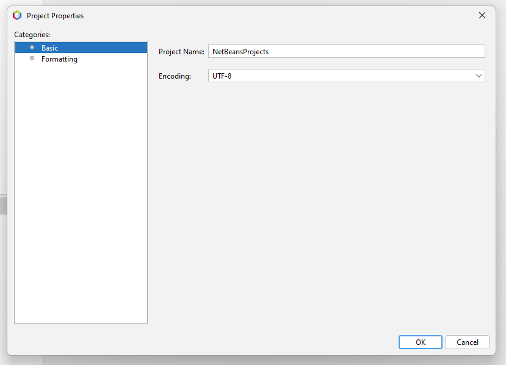
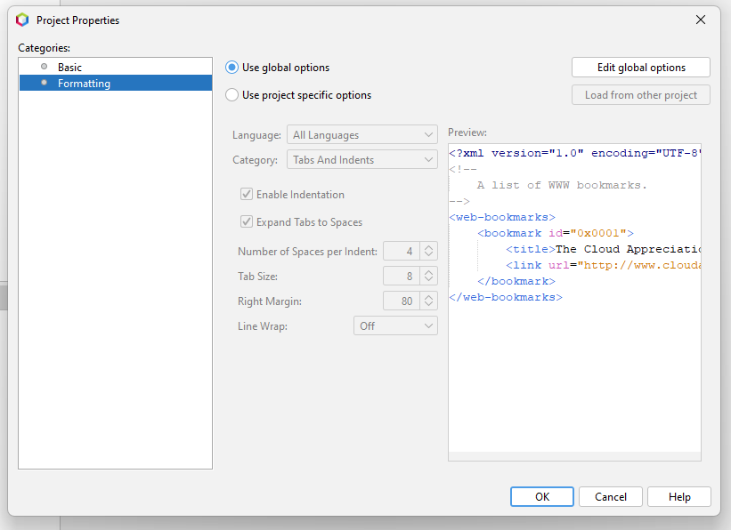

# Open Folder as Project - NetBeans Plugin

Turn **any folder** into a NetBeans project - no build files, no config, no fuss.

NetBeans is project-oriented, but sometimes you just want to open a folder and start working.
This plugin bridges that gap: pick a folder, and it becomes a first-class project in NetBeans.
All metadata lives in your NetBeans settings directory, so your project folder stays clean - no surprises with version control.

## Screenshots

Project View



Project Properties



Formatting Settings



## Features

- **Zero Configuration** - Open any folder as a project via *File > Open Folder as Project*. A hidden `.netbeans` marker is created automatically
- **Code Formatting** - Per-project code formatting settings, stored outside the project folder
- **Project Operations** - Full support for rename, move, and delete with automatic preference migration
- **Custom Encoding** - Set character encoding per project
- **Minimal Footprint** - Only a small `.netbeans` marker folder is created in the project directory (similar to `.idea` for IntelliJ or `.vscode` for VS Code). All other settings are stored in NetBeans preferences

## Installation

### From NBM File

1. Download the latest `.nbm` file from the [Releases](https://github.com/Chris2011/netbeans-plugin-collection/releases)
2. In NetBeans, go to **Tools > Plugins > Downloaded**
3. Click **Add Plugins...** and select the `.nbm` file
4. Follow the installation wizard

### Build from Source

```bash
# Clone the repository
git clone https://github.com/Chris2011/netbeans-plugin-collection.git

# Navigate to the plugin directory
cd netbeans-plugin-collection/ide/open-folder-as-project

# Build the NBM
gradle packageNbm
```

The built `.nbm` file will be in `build/nbm/`.

## Usage

1. Go to **File > Open Folder as Project**
2. Select any folder
3. Done - the folder appears as a project in the Projects window

Right-click the project for standard operations like rename, move, delete, and project properties (encoding, formatting).

## Requirements

| Requirement    | Version      |
|----------------|--------------|
| Apache NetBeans | 11.0+       |
| Java           | 11+          |

## Tech Stack

- **Build System:** Gradle
- **Platform:** NetBeans Module (NBM)
- **Language:** Java 11

## Credits

Originally created by [Tim Boudreau](https://github.com/timboudreau) as [adhoc-projects](https://github.com/timboudreau/adhoc-projects).
Maintained and modernized by [Christian Lenz](https://github.com/Chris2011).

## License

[MIT](https://opensource.org/licenses/MIT) - do what thou wilt, give credit where it's due.
